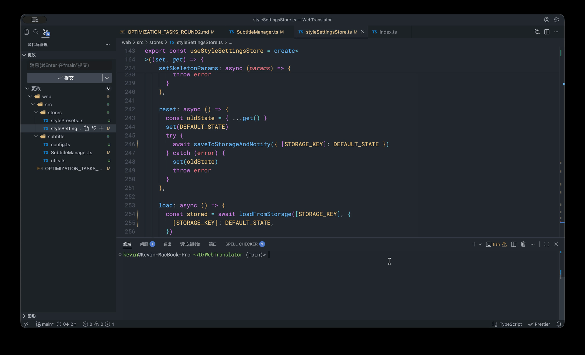

English | [简体中文](README-ZH.md)

# easyGit

[](https://github.com/KevinYouu/easyGit/releases)
[](LICENSE)
[](go.mod)
[]()

🚀 A modern interactive Git CLI that streamlines your daily Git workflow. Make commits, manage branches, handle tags, and more - all through an intuitive terminal interface. Supports Linux/macOS/Windows

> This project uses its own features to commit code - dogfooding at its finest!



## 📖 What is easyGit?

**easyGit is designed for developers who love Git but want to work faster.**

Instead of typing multiple Git commands or remembering complex flags, easyGit provides:

- ⚡ **One-Command Workflows** - Push all changes or select specific files with a single command
- 🎯 **Interactive Selection** - Choose branches, commits, tags, and files through visual menus
- 🔧 **Smart Configuration** - Save your push preferences (remote/branch) and language settings
- 🌍 **Multilingual** - Full English and Chinese support with auto-detection
- 🎨 **Beautiful Interface** - Clear visual feedback with modern TUI components
- 📐 **Responsive Layout** - Tables, forms, and progress bars adapt to terminal size; wide screens are fully utilized, narrow screens never overflow
- 💻 **Cross-Platform** - Works seamlessly on Linux, macOS, and Windows

## 📖 Design Philosophy

**easyGit is a Git workflow enhancement tool, not a replacement for Git commands.**

We focus on:

- 🎯 **Integrating multi-step workflows** - Combining multiple Git commands into one interactive flow
- 🧠 **Simplifying complex commands** - Providing friendly UIs for hard-to-remember parameters
- 🚀 **Optimizing repetitive work** - Batch operations and smart defaults
- ✨ **Enhancing user experience** - Beautiful TUI with clear visual feedback

📚 Read more: [Design Philosophy](docs/DESIGN_PHILOSOPHY.md) | [设计哲学 (中文)](docs/DESIGN_PHILOSOPHY_ZH.md)

---

## ⚡ Why easyGit?

### easyGit vs Native Git

See how much time you can save with easyGit:

| Operation            | Native Git                                                      | easyGit                        | Time Saved |
| -------------------- | --------------------------------------------------------------- | ------------------------------ | ---------- |
| Commit all changes   | `git add .`<br>`git commit -m "msg"`<br>`git push`              | `easyGit pa`                   | **~75%**   |
| Delete remote branch | `git push origin --delete branch-name`                          | `easyGit bd` (interactive)     | **~60%**   |
| Create & push tag    | `git tag v1.0.0`<br>`git push origin v1.0.0`                    | `easyGit tc` (with wizard)     | **~70%**   |
| Merge feature branch | `git checkout main`<br>`git merge feature`<br>`git push`        | `easyGit m` (interactive)      | **~65%**   |
| Rebase branch        | `git branch` (find name)<br>`git rebase <branch>`               | `easyGit r` (visual selector)  | **~60%**   |
| Cherry-pick commit   | `git log` (find hash)<br>`git cherry-pick <hash>`<br>`git push` | `easyGit cp` (visual selector) | **~70%**   |
| Squash commits       | `git rebase -i` (manual edit)                                   | `easyGit sq` (visual multi-select) | **~70%**   |
| Drop commits         | `git rebase -i` (manual delete)                                 | `easyGit d` (visual multi-select)  | **~75%**   |

**Benefits:**

- 🎯 **Interactive Selection** - No need to remember branch names, commit hashes, or tag names
- 🔄 **Workflow Integration** - Multiple Git commands combined into one
- 💡 **Smart Defaults** - Remembers your preferences (remote, branch, language)
- ✅ **Error Prevention** - Visual confirmation before destructive operations

---

## 📦 Installation

### Prerequisites

- [Git](https://git-scm.com/) must be installed on your system

### System Requirements

- **Operating System:** Linux / macOS / Windows 10+
- **Git Version:** 2.0+
- **Terminal:** Modern terminal with ANSI color support
- **Disk Space:** < 10MB

### Quick Install (Recommended)

**Linux / macOS:**

```bash
# Using curl
curl -sSL https://raw.githubusercontent.com/KevinYouu/easyGit/main/install.sh | bash

# Or using wget
wget -qO- https://raw.githubusercontent.com/KevinYouu/easyGit/main/install.sh | bash
```

**Windows:**

```powershell
# Using PowerShell
iwr -useb https://raw.githubusercontent.com/KevinYouu/easyGit/main/install.ps1 | iex
```

### Build from Source

Works on all platforms with Go installed:

```bash
git clone https://github.com/KevinYouu/easyGit.git
cd easyGit
./build.sh
```

### Verify Installation

After installation, verify that easyGit is working correctly:

```bash
# Check if easyGit is installed
easyGit version

# Expected output:
# easyGit version x.x.x
# Built with Go 1.21+

# Try a simple command
easyGit --help
```

If you encounter any issues, see the [FAQ](#-faq) section.

---

## 🚀 Quick Start

### Basic Usage

```bash
# Push all changes in the working directory
easyGit push-all  # or: easyGit pa

# Push selected files in the working directory
easyGit push-selected  # or: easyGit ps

# Initialize easyGit configuration (usually auto-initialized on first run)
easyGit init
```

### Advanced Operations

```bash
# Create and push a tag
easyGit tag-create  # or: easyGit tc

# Delete a tag
easyGit tag-delete  # or: easyGit td

# Delete local or remote branches
easyGit branch-delete  # or: easyGit bd

# Merge selected branch into current branch
easyGit merge  # or: easyGit m

# Rebase current branch onto another
easyGit rebase  # or: easyGit r

# Cherry-pick commits
easyGit cherry-pick  # or: easyGit cp

# Reset to selected commit
easyGit reset  # or: easyGit rs

# Squash contiguous commits into one
easyGit squash  # or: easyGit sq

# Drop/Delete specific commits
easyGit drop  # or: easyGit d

# Configure push settings (remote and branch)
easyGit set-push-config

# Set interface language
easyGit set-language

# Update easyGit
easyGit update
```

## 📖 Command Reference

### Daily Operations

| Command         | Alias | Description                                    | Use Case                                 |
| --------------- | ----- | ---------------------------------------------- | ---------------------------------------- |
| `push-all`      | `pa`  | Stage and commit all changed files             | Quick commits for all modifications      |
| `push-selected` | `ps`  | Interactively select files to stage and commit | Fine-grained control over what to commit |

### Branch & Tag Management

| Command         | Alias | Description                                   | Use Case                                  |
| --------------- | ----- | --------------------------------------------- | ----------------------------------------- |
| `merge`         | `m`   | Merge selected branch into current branch     | Integrate feature branches                |
| `branch-delete` | `bd`  | Delete local or remote branches               | Clean up merged or obsolete branches      |
| `tag-create`    | `tc`  | Create and push tags with semantic versioning | Release versioning (v1.0.0, v2.1.0, etc.) |
| `tag-delete`    | `td`  | Delete tags locally and remotely              | Remove incorrect or obsolete tags         |

### Advanced Git Operations

| Command       | Alias | Description                             | Use Case                                 |
| ------------- | ----- | --------------------------------------- | ---------------------------------------- |
| `rebase`      | `r`   | Rebase current branch onto another      | Keep a linear history                    |
| `cherry-pick` | `cp`  | Cherry-pick commits from other branches | Apply specific commits to current branch |
| `reset`       | `rs`  | Reset repository to selected commit     | Undo commits or move to previous state   |
| `squash`      | `sq`  | Squash contiguous commits into one      | Clean up local commit history (visual)   |
| `drop`        | `d`   | Delete specific commits                 | Remove unwanted commits from history     |

### Configuration & Utilities

| Command           | Alias | Description                                 | Use Case                             |
| ----------------- | ----- | ------------------------------------------- | ------------------------------------ |
| `init`            | -     | Initialize easyGit configuration            | First-time setup (usually automatic) |
| `set-push-config` | -     | Configure default push remote(s) and branch | Save your preferred push settings    |
| `set-language`    | -     | Set default language                        | Change interface language            |
| `update`          | -     | Update easyGit to latest version            | Get new features and bug fixes       |
| `version`         | `v`   | Show current version information            | Check installed version              |

---

## 🛠️ Development

### Building from Source

```bash
# Clone the repository
git clone https://github.com/KevinYouu/easyGit.git
cd easyGit

# Install dependencies
go mod tidy

# Build with version injection
./build.sh

# Or build manually
go build -o easyGit ./cmd/easygit
```

### Running Tests

```bash
# Run all tests
go test ./...

# Run specific package tests
go test ./internal/i18n

# Run benchmarks
go test -bench=. ./internal/i18n
```

### Project Structure

```
easyGit/
├── cmd/easygit/          # CLI commands and entry point
│   ├── main.go          # Application entry point
│   ├── root.go          # Root command setup
│   └── commands/        # Individual command implementations
├── internal/            # Internal packages
│   ├── gitcmd/          # Git operation implementations
│   ├── i18n/            # Internationalization
│   ├── form/            # TUI form components
│   ├── spinner/         # Loading animations
│   ├── theme/           # Visual styling
│   └── config/          # Configuration management
└── docs/                # Documentation
```

---

## 🔧 Compatibility

✅ Fully compatible with native Git workflow
✅ Can be used alongside Git commands
✅ Does not modify `.git` directory structure
✅ Supports all Git hooks

---

## ❓ FAQ

### How is easyGit different from other Git tools?

easyGit focuses on **workflow integration** rather than replacing individual Git commands. It combines multiple Git operations into interactive flows, making complex tasks simple.

### Does easyGit modify my Git repository?

No. easyGit uses standard Git commands under the hood and doesn't modify your `.git` directory structure. You can safely use it alongside regular Git commands.

### Can I use easyGit in CI/CD pipelines?

easyGit is designed for interactive terminal use. For CI/CD, we recommend using standard Git commands.

### What if I encounter a bug?

Please [open an issue](https://github.com/KevinYouu/easyGit/issues) with:

- Your OS and Git version
- Steps to reproduce
- Expected vs actual behavior

### How do I verify the installation?

```bash
# Check version
easyGit version

# Expected output
easyGit version x.x.x
Built with Go 1.21+
```

---

## 🤝 Contributing

Contributions are welcome! Please feel free to submit a Pull Request. For major changes, please open an issue first to discuss what you would like to change.

### Development Guidelines

- Follow Go conventions and best practices
- Add tests for new features
- Update documentation as needed
- Ensure all commands support both English and Chinese

---

## 📄 License

This project is licensed under the GPL-3.0 License - see the [LICENSE](LICENSE) file for details.

## 🙏 Acknowledgments

Built with these amazing open source projects:

### Core Dependencies

- [Go](https://github.com/golang/go) - The Go programming language
- [Cobra](https://github.com/spf13/cobra) - Powerful CLI framework
- [Bubbletea v2](https://charm.land/bubbletea) - Powerful TUI framework
- [Bubbles v2](https://charm.land/bubbles) - TUI components for Bubbletea
- [Huh v2](https://charm.land/huh) - Interactive terminal forms
- [Lipgloss v2](https://charm.land/lipgloss) - Style definitions for terminal UI
- [SQLite](https://gitlab.com/cznic/sqlite) - Pure Go SQLite implementation for configuration storage
- [golang.org/x/term](https://pkg.go.dev/golang.org/x/term) - Terminal utilities
- [golang.org/x/text](https://pkg.go.dev/golang.org/x/text) - Text processing and i18n support

---

**Made with ❤️ by [KevinYouu](https://github.com/KevinYouu)**
